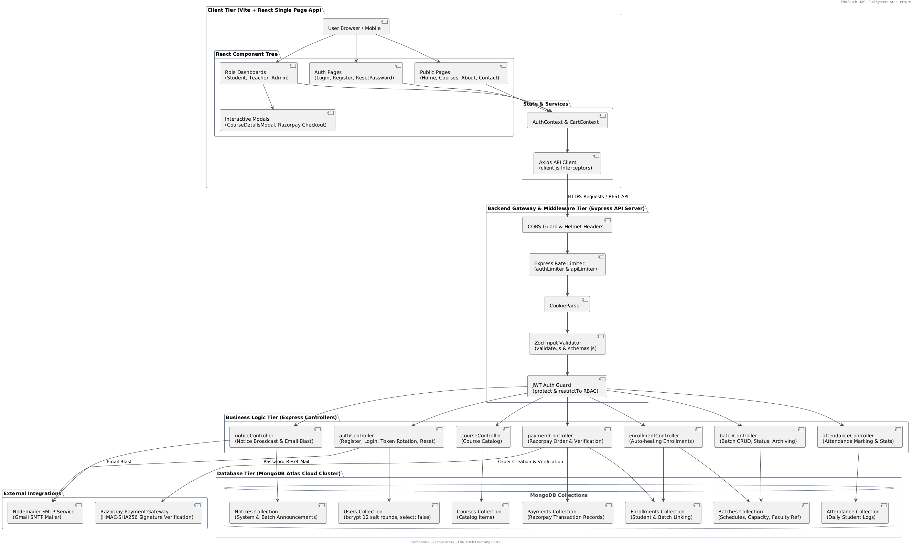
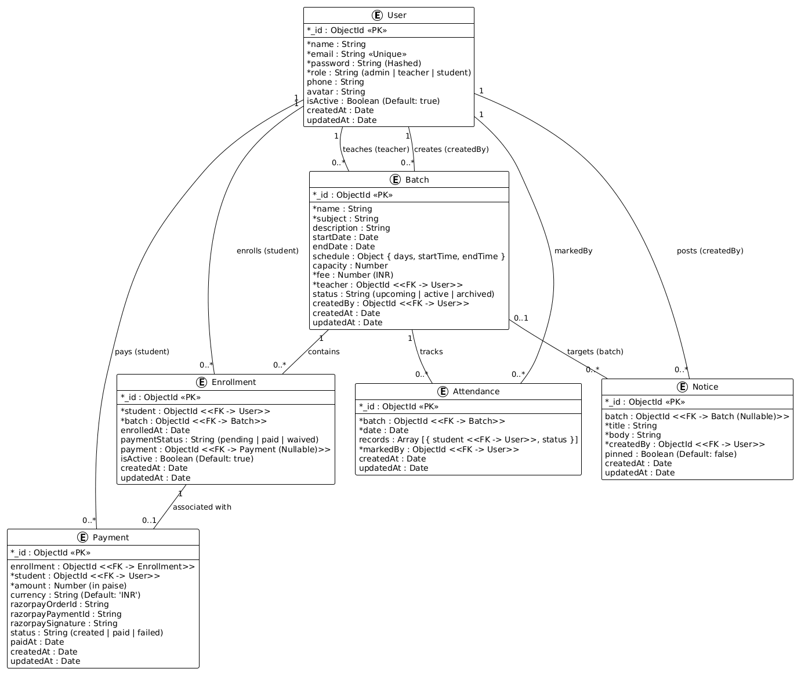

# EduBatch — Batch-Centric LMS & Education Management System

EduBatch is a full-stack Learning Management System (LMS) designed for educational institutes, coaching centers, and online academies. It provides role-based portals for **Students**, **Teachers**, and **Admins** with automated Razorpay fee payments, live classroom management, attendance tracking, SMTP email broadcasts, and interactive course materials.

---

## 🔑 Demo Test Credentials

You can test all user roles using the pre-configured credentials below:

| Role | Email | Password | Primary Capabilities |
| :--- | :--- | :--- | :--- |
| 👑 **Admin** | `admin@edubatch.com` | `AdminPassword123!` | Create/Update/Archive Batches, view all payments & enrollments, manage system notices |
| 👨‍🏫 **Teacher** | `teacher@edubatch.com` | `TeacherPassword123!` | View assigned batches, mark daily student attendance, broadcast batch notices |
| 🎓 **Student** | `student@edubatch.com` | `StudentPassword123!` | Browse courses, add to cart, pay batch fees via Razorpay, access syllabus & DPP notes |

---

## 📁 Project Folder Structure

```
EduBatch/
├── client/                      # React Frontend (Vite + Tailwind CSS)
│   ├── public/                  # Public static images (main_image.png, teacher_image.png)
│   ├── src/
│   │   ├── api/                 # Axios HTTP client & domain API modules
│   │   ├── components/          # Reusable UI components & modals (CourseDetailsModal, LoadingSpinner)
│   │   ├── context/             # AuthContext & CartContext state providers
│   │   ├── pages/               # Student, Teacher, Admin, and Public pages
│   │   ├── App.jsx              # Application routes & layout wrapper
│   │   └── main.jsx             # React DOM entry point
│   ├── .env.example             # Client environment template
│   └── vercel.json              # Vercel SPA rewrite configuration
├── server/                      # Express API Backend (Node.js + MongoDB)
│   ├── api/index.js             # Vercel serverless function entrypoint
│   ├── src/
│   │   ├── config/              # MongoDB connection & environment loader
│   │   ├── controllers/         # Auth, Batch, Course, Enrollment, Attendance, Notice, Payment controllers
│   │   ├── middleware/          # Protect, Role Guard, Zod Validator, Rate Limiter, Error Handler
│   │   ├── models/              # User, Batch, Course, Enrollment, Attendance, Notice, Payment Mongoose schemas
│   │   ├── routes/              # Express API route handlers
│   │   ├── services/            # Nodemailer email broadcast service
│   │   ├── validators/          # Zod validation schemas
│   │   └── app.js               # Express application initialization
│   ├── seed.js                  # Database seeder script
│   ├── .env.example             # Server environment template
│   └── vercel.json              # Server Vercel configuration
├── vercel.json                  # Root monorepo Vercel configuration
├── .gitignore                   # Global workspace gitignore
└── README.md                    # Project documentation
```

---

## 🛠️ Step-by-Step Local Setup Instructions

Follow these exact steps to run EduBatch locally on your machine:

### Prerequisites
- **Node.js**: v18.0.0 or higher
- **npm**: v9.0.0 or higher
- **MongoDB**: Local MongoDB instance or a free MongoDB Atlas Cluster

---

### Step 1: Clone the Repository
```bash
git clone https://github.com/bidhuripriyanshu/EduBatch.git
cd EduBatch
```

---

### Step 2: Install Server & Client Dependencies

1. **Install Backend Dependencies**:
   ```bash
   cd server
   npm install
   ```

2. **Install Frontend Dependencies**:
   ```bash
   cd ../client
   npm install
   ```

---

### Step 3: Configure Environment Variables

1. **Backend Environment Setup**:
   Copy `.env.example` in `server/` to `.env`:
   ```bash
   cd ../server
   cp .env.example .env
   ```
   *Edit `server/.env` with your MongoDB connection string and SMTP/Razorpay keys:*
   ```env
   PORT=5000
   NODE_ENV=development
   MONGO_URI=mongodb+srv://<username>:<password>@cluster0.mongodb.net/edubatch
   JWT_SECRET=edubatch_super_secret_jwt_key_2026
   JWT_EXPIRES_IN=15m
   JWT_REFRESH_SECRET=edubatch_super_refresh_secret_key_2026
   JWT_REFRESH_EXPIRES_IN=7d
   CLIENT_URL=http://localhost:5173
   RAZORPAY_KEY_ID=rzp_test_TZtVO8OdrBdUTh
   RAZORPAY_KEY_SECRET=88p6ws5we4mVLzh4m2elbY3J
   SMTP_HOST=smtp.gmail.com
   SMTP_PORT=587
   SMTP_USER=your_email@gmail.com
   SMTP_PASS=your_app_password
   ```

2. **Frontend Environment Setup**:
   Copy `.env.example` in `client/` to `.env`:
   ```bash
   cd ../client
   cp .env.example .env
   ```
   *Verify `client/.env`:*
   ```env
   VITE_API_BASE_URL=http://localhost:5000/api/v1
   VITE_RAZORPAY_KEY_ID=rzp_test_TZtVO8OdrBdUTh
   ```

---

### Step 4: Seed the Database

Run the database seeder to populate default Admin, Teacher, Student accounts, and test batches:
```bash
cd ../server
npm run seed
```

---

### Step 5: Start Development Servers

1. **Start Backend Express Server**:
   ```bash
   cd server
   npm run dev
   ```
   *(Backend starts on `http://localhost:5000`)*

2. **Start Frontend Vite Server** (in a new terminal):
   ```bash
   cd client
   npm run dev
   ```
   *(Frontend starts on `http://localhost:5173`)*

---

## 🗄️ Database Setup Instructions

1. **MongoDB Atlas Setup**:
   - Create a free cluster on [MongoDB Atlas](https://www.mongodb.com/cloud/atlas).
   - Under **Database Access**, create a user with read/write permissions.
   - Under **Network Access**, add `0.0.0.0/0` (Allow Access from Anywhere).
   - Copy the Connection String and set it as `MONGO_URI` in `server/.env`.

2. **Database Models & Relationships**:
   - **User**: Name, Email, Hashed Password (`select: false`), Role (`admin` | `teacher` | `student`), Phone, Avatar, RefreshToken.
   - **Batch**: Name, Subject, Category, Fee, Schedule (`startTime`, `endTime`, `days`), Capacity, Teacher (ref User), Status (`active` | `upcoming` | `archived`).
   - **Enrollment**: Student (ref User), Batch (ref Batch), PaymentStatus (`paid` | `pending`), PaymentId.
   - **Attendance**: Batch (ref Batch), Date, Records (`student`, `status` (`present` | `absent` | `late`)), MarkedBy.
   - **Notice**: Title, Body, Batch (ref Batch, optional for global), Pinned, CreatedBy (ref User).
   - **Payment**: RazorpayOrderId, RazorpayPaymentId, RazorpaySignature, Amount, Currency, Status, Student, Enrollment.

---

## 📡 API Endpoint Reference

### Authentication Routes (`/api/v1/auth`)
- `POST /api/v1/auth/register` — Register a new account (Rate Limited & Zod Validated)
- `POST /api/v1/auth/login` — Login user, sets HTTP-Only refresh token cookie
- `POST /api/v1/auth/refresh` — Rotate access token (15m) & refresh token (7d)
- `POST /api/v1/auth/logout` — Revoke session & clear HTTP-Only cookie
- `GET /api/v1/auth/me` — Fetch currently authenticated user profile
- `POST /api/v1/auth/forgot-password` — Send SHA-256 hashed password reset token via SMTP
- `POST /api/v1/auth/reset-password` — Reset password using token
- `PATCH /api/v1/auth/update-password` — Change password for logged-in user

### Batch Routes (`/api/v1/batches`)
- `GET /api/v1/batches` — Get all active batches
- `POST /api/v1/batches` — Create a new batch (Admin only)
- `GET /api/v1/batches/:id` — Get single batch details
- `PUT /api/v1/batches/:id` — Update batch details (Admin only)
- `PATCH /api/v1/batches/:id/status` — Change status (`active` | `upcoming` | `archived`)
- `DELETE /api/v1/batches/:id` — Soft archive batch

### Enrollment & Payment Routes (`/api/v1/enrollments` & `/api/v1/payments`)
- `GET /api/v1/enrollments/my` — Get logged-in student's enrollments (with auto-healing for unlinked payments)
- `POST /api/v1/enrollments` — Enroll student into a batch
- `POST /api/v1/payments/create-order` — Generate Razorpay Order ID
- `POST /api/v1/payments/verify` — Verify Razorpay HMAC-SHA256 signature and update payment status to `paid`
- `GET /api/v1/payments/history` — Fetch user/admin payment transaction history

### Attendance Routes (`/api/v1/attendance`)
- `GET /api/v1/attendance/my` — Get student's overall & batch-specific attendance summary
- `POST /api/v1/attendance` — Mark daily attendance for a batch (Teacher/Admin only)
- `GET /api/v1/attendance/batch/:id` — Get attendance history for a batch

### Notice Routes (`/api/v1/notices`)
- `GET /api/v1/notices` — Get notices for logged-in user's batches
- `POST /api/v1/notices` — Broadcast notice & send email blast via Nodemailer SMTP (Teacher/Admin)

---

## 🚀 Production Deployment Details

### Deploying Frontend to Vercel
1. Import repository into Vercel and set **Root Directory** to `client`.
2. Vercel automatically detects the Vite framework and outputs to `dist`.
3. Under **Environment Variables**, select **Config** type and set:
   - `VITE_API_BASE_URL` = `https://<your-backend-app>.vercel.app/api/v1`
   - `VITE_RAZORPAY_KEY_ID` = `rzp_test_TZtVO8OdrBdUTh`
4. Deploy! Single-page app routing is handled automatically via `client/vercel.json`.

### Deploying Backend to Vercel / Render
1. Import repository into Vercel/Render and set **Root Directory** to `server`.
2. For Vercel, the serverless entrypoint `server/api/index.js` handles routing.
3. Under **Environment Variables**, add all keys from `server/.env.example`:
   - `NODE_ENV` = `production`
   - `MONGO_URI` = your MongoDB Atlas connection string
   - `CLIENT_URL` = `https://<your-frontend-app>.vercel.app`
   - `JWT_SECRET`, `RAZORPAY_KEY_ID`, `RAZORPAY_KEY_SECRET`, `SMTP_USER`, `SMTP_PASS`

---

## 💡 Key Architectural Assumptions & Decisions

1. **Auto-Healing Enrollment Linking**:
   When students pay via the course cart, payments can occasionally complete before an enrollment document is linked. The `getMyEnrollments` API automatically inspects unlinked paid transactions and auto-heals enrollment records so paid batch cards appear immediately.

2. **Security-First Password Architecture**:
   All passwords are hashed using **bcrypt with 12 salt rounds** (exceeding the minimum requirement of 10). The `password` attribute has `select: false` set in Mongoose schema to prevent accidental leaks in DB queries or API JSON responses.

3. **JWT Access & Refresh Token Rotation**:
   Auth tokens use a dual-token strategy: a short-lived 15-minute Access Token alongside a 7-day HTTP-Only Refresh Token. Refreshing tokens invalidates the previous refresh token in MongoDB and issues a freshly rotated pair.

4. **Strict Input Validation & Security Headers**:
   API payloads are strictly validated using **Zod schemas** before business execution. HTTP headers are protected via **Helmet**, rate-limited via **express-rate-limit** (10 auth req / 15 min), and restricted to authorized frontend origins via CORS.

---

## 📐 System & Database Architecture Diagrams

### 1. Full System Architecture Diagram


### 2. Database & Data Model Architecture Diagram


